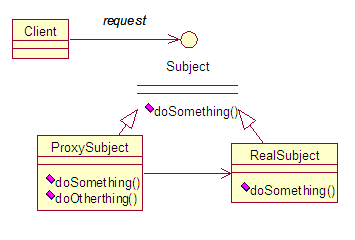
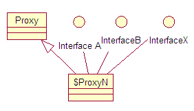

# Java SE Dynamic Proxy

## 概念

>代理指的是，通过操作代理类，实现对被代理类的操作，而不是直接操作被代理类。和静态代理类似的是，动态代理也实现了同样的功能；和静态代理不同的是，静态代理于编译时便能确定关系，动态代理的发生在运行时，动态确定代理类与被代理类的关系。

oracle官网的解释如下：

>A dynamic proxy class is a class that implements a list of interfaces specified at runtime such that a method invocation through one of the interfaces on an instance of the class will be encoded and dispatched to another object through a uniform interface. Thus, a dynamic proxy class can be used to create a type-safe proxy object for a list of interfaces without requiring pre-generation of the proxy class, such as with compile-time tools. Method invocations on an instance of a dynamic proxy class are dispatched to a single method in the instance's invocation handler, and they are encoded with a java.lang.reflect.Method object identifying the method that was invoked and an array of type Object containing the arguments.

## 图例



## 详解

java中的动态代理主要涉及到接口InvocationHandler以及类Proxy。

java docs中对接口InvocationHandler的描述是：

>InvocationHandler is the interface implemented by the invocation handler of a proxy instance.
Each proxy instance has an associated invocation handler. When a method is invoked on a proxy instance, the method invocation is encoded and dispatched to the invoke method of its invocation handler.

java docs中对类Proxy的描述是：

>Proxy provides static methods for creating dynamic proxy classes and instances, and it is also the superclass of all dynamic proxy classes created by those methods.


首先，对于代理类，动态代理需要代理类实现InvocationHandler接口，InvocationHandler接口中只有一个声明的方法invoke：```Object invoke(Object proxy, Method method, Object[] args) throws Throwable```。Object proxy为代理类实例；Method method为被代理对象需要被执行的方法；Object[] args为被执行方法的入参，为一数组。

定义好代理类后，需要使用Proxy类来动态生成实现了InvocationHandler接口的代理类，使用静态方法newProxyInstance：```public static Object newProxyInstance(ClassLoader loader, Class<?>[] interfaces, InvocationHandler h) throws IllegalArgumentException```。ClassLoader loader定义了由哪个ClassLoader对象来对定义与生成的代理对象；Class<?>[] interfaces定义了代理类可以执行哪些被代理类实现的接口里的方法，也就是指明返回的代理对象要实现哪些接口；InvocationHandler h为被代理的对象，该对象已实现了InvocationHandler接口。该方法返回了一个代理对象Object，java docs
中的描述是：

>a proxy instance with the specified invocation handler of a proxy class that is defined by the specified class loader and that implements the specified interfaces

因此可通过类型转换讲该Object类型的代理对象转换成具体被代理接口的实例，以执行接口中声明的方法。代理类仅支持interface代理，所有代理类继承于一个共同的父类Proxy，具有final和public修饰符，意味着它可以被所有的类访问，但是不能被再度继承。代理类的类名字为ProxyN，其中N是一个逐一递增的阿拉伯数字，代表 Proxy 类第N次生成的动态代理类，值得注意的一点是，并不是每次调用Proxy的静态方法创建动态代理类都会使得N值增加，原因是如果对同一组接口（包括接口排列的顺序相同）试图重复创建动态代理类，它会很聪明地返回先前已经创建好的代理类的类对象，而不会再尝试去创建一个全新的代理类，这样可以节省不必要的代码重复生成，提高了代理类的创建效率（内部实现了缓存）。

代理类继承关系如下：



## Sample

- RealSubject

        public interface RealSubject {
            void method();
        }

- RealSubject1

        public interface RealSubject1 {
            void method1();
        }

- RealSubjectImpl

        public class RealSubjectImpl implements RealSubject,RealSubject1 {
    
            @Override
            public void method() {
                System.out.println("this is method");
            }

            @Override
            public void method1() {
                System.out.println("this is method1");
            }

        }

- ProxySubject

        import java.lang.reflect.InvocationHandler;
        import java.lang.reflect.Method;

        public class ProxySubject implements InvocationHandler {
            private Object proxied;
            ProxySubject(Object proxied){
                this.proxied = proxied;
            }
            @Override
            public Object invoke(Object proxy, Method method, Object[] args) throws Throwable {
                System.out.println(proxy.getClass().getName());
                return method.invoke(proxied,args);
            }
        }


- Client

        import java.lang.reflect.Proxy;

        public class Client {

            public static void main(String[] args) {

                RealSubject rs = (RealSubject)Proxy.newProxyInstance(RealSubject.class.getClassLoader(),
                        new Class[]{RealSubject.class},
                        new ProxySubject(new RealSubjectImpl()));
                rs.method();

                RealSubject1 rs1 = (RealSubject1)Proxy.newProxyInstance(RealSubject1.class.getClassLoader(),
                        new Class[]{RealSubject1.class},
                        new ProxySubject(new RealSubjectImpl()));
                rs1.method1();
            }
        }


## Keywords

```java.lang.reflect.InvocationHandler```,  ```java.lang.reflect.Proxy```,  ```newProxyInstance()```...
